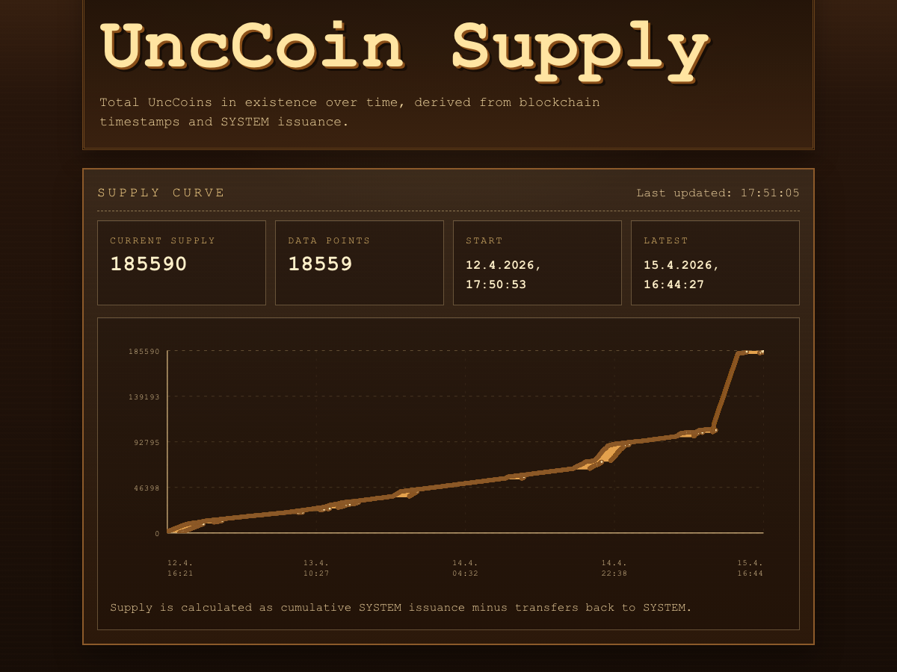

# UncCoin

UncCoin is a toy but fairly complete proof-of-work cryptocurrency built in Python. It supports signed wallets and transactions, balances and nonces, miner rewards and fees, peer-to-peer transaction and block relay, chain sync, orphan handling, persistence, and an interactive node CLI.

## What It Does

- signed transactions with balances and nonces
- fixed mining rewards and miner fees
- SHA-256 proof of work
- P2P transaction, block, and wallet-message relay
- chain sync on connect
- orphan block handling
- canonical-chain persistence
- interactive node CLI
- private automine mode for dedicated miners

## PoW Evolution

The proof-of-work rule stayed simple: find a block hash with enough leading zero bits. The implementation evolved like this:

- started as a pure Python miner
- moved the hot nonce-search loop into a native C extension
- added Apple Metal support for local GPU mining on macOS
- added a Linux/CUDA backend, chunked CPU/GPU scheduling, and local autotuning

Shoutout to Niklas Unneland, who built [unccoin.no](https://unccoin.no/) around the project.

## Docs

- [GettingStarted.md](/Users/frederikedvardsen/Desktop/unccoin/GettingStarted.md)
  First local setup, wallet creation, native build, and running nodes.
- [Tailscale.md](/Users/frederikedvardsen/Desktop/unccoin/Tailscale.md)
  Running UncCoin across multiple devices over Tailscale.

## Interactive Node Commands

```text
peers
known-peers
discover
sync
localself
add-peer <host:port>
alias <wallet-id> <alias>
autosend <wallet-id>
autosend off
mute
unmute
tx <receiver> <amount> <fee>
commit <request-id> <commitment-hash> <fee>
reveal <request-id> <seed> <fee> [salt]
deploy <fee> <json-or-file>
authorize <contract> <request-id> [valid-blocks]
execute <contract> <gas-limit> <gas-price> <value> <max-fee> <json>
receipt <txid-prefix>
msg <wallet> <content>
messages
mine [description]
automine [description]
stop
blockchain
balance [address]
balances
balances >100
balances <50
txtbalances <relative-path>
txtblockchain <relative-path>
send <host:port> <json>
clear
quit
<raw json>
```

Commands that take wallet ids such as `tx`, `msg`, `balance`, and `alias` accept either a raw wallet address or a locally stored alias.

## Typed Transactions

UncCoin transactions are now versioned and typed. Existing money movement is a `transfer`
transaction. `commit` records a 64-character hex commitment hash under a caller-provided
`request_id`, keyed by the committing wallet address. This is intended as the first chain
primitive for future shared-randomness workflows where a later UVM program can link a
participant's commitment to a later seed upload.

`reveal` uploads the seed for a prior commitment. The commitment hash is:

```text
sha256("UVM_REVEAL|1|<wallet>|<request_id>|<seed>|<salt>")
```

Seeds are normalized as unsigned 256-bit integers. Decimal and `0x` hexadecimal seed strings
are accepted. Salt is optional.

`deploy` stores UVM code and metadata under a deterministic contract address derived from the
deployer, deploy nonce, and code hash. The deploy source can be inline JSON or a file in
`state/contracts`. The JSON can be either a program directly or an object with `program` and
`metadata` fields. Metadata is an object; `metadata.request_ids` is reserved for request ids
relevant to the contract. For example, `deploy 0 coinflip.uvm` deploys
`state/contracts/coinflip.uvm` and prints the derived contract address and code hash.

`authorize` prints a signed off-chain UVM consent receipt for a deployed contract and request
id. The receipt is not broadcast by itself; hand it to the executor, who includes it in the
`authorizations` list of an `execute` transaction.

`execute` runs deployed UVM code, or inline code when no deployed contract exists. The execute
JSON can be a program directly or an object with `input` and `authorizations` fields.

`receipt` prints a UVM execution receipt by transaction id or unique transaction-id prefix.

The `execute` transaction kind runs a first-pass UncCoin Virtual Machine program. It carries
the contract address, gas limit, optional value, max fee escrow, gas price, and signed request
authorizations bound to `wallet + contract_address + code_hash + request_id`. If the contract
address has deployed code, that deployed program runs; otherwise `execute` can still carry an
inline program for compatibility.

UVM authorizations may be scoped with `valid_from_height` and `valid_until_height`. Height
limits make the authorization valid only for specific block heights;
`create_uvm_authorization(..., current_height=<h>, valid_for_blocks=<n>)` signs a window for
the next `n` blocks, from `h + 1` through `h + n`.

## UncCoin Virtual Machine

The UVM is a deterministic stack machine. Programs can be provided as a JSON instruction list
or as simple assembly text. Each instruction is charged gas before it executes; if gas runs
out, the execute transaction is still included with a failed receipt, but no UVM state changes
are applied.

Example program:

```json
[
  ["READ_COMMIT", "<wallet-address>", "casino-play-1"],
  ["STORE", "commitment"],
  ["HALT"]
]
```

`READ_COMMIT <wallet> <request_id>` is protected: the execute transaction must include a
valid UVM authorization signature from `<wallet>` for that exact `<request_id>`. Missing or
invalid authorization makes execution invalid.

`READ_REVEAL <wallet> <request_id>` reads a public revealed seed and pushes it as a stack
integer.

`HAS_REVEAL <wallet> <request_id>` pushes `1` when that wallet has revealed for the request
and `0` otherwise. `BLOCK_HEIGHT` pushes the block height currently executing the contract,
which lets contracts distinguish "not revealed yet" from "missed the deadline."

`TRANSFER_FROM <source> <receiver> <request_id>` pops a positive integer amount and moves
that amount between balances. The source must be the execute transaction sender, the contract
itself, or a wallet that provided a valid UVM authorization for the exact request id. The
receiver does not need to sign because receiving funds is not a sensitive operation. Use the
reserved account operand `$CONTRACT` when an instruction needs to refer to the currently
executing contract's deterministic address.

Instructions:

```text
PUSH <int>
POP
DUP
SWAP
ADD
SUB
MUL
DIV
MOD
EQ
LT
GT
AND
OR
XOR
NOT
SHA256
MEM_LOAD <key>
MEM_STORE <key>
LOAD <key>
STORE <key>
READ_COMMIT <wallet> <request_id>
READ_REVEAL <wallet> <request_id>
HAS_REVEAL <wallet> <request_id>
TRANSFER_FROM <source> <receiver> <request_id>
HAS_AUTH <wallet> <request_id>
REQUIRE_AUTH <wallet> <request_id>
BLOCK_HEIGHT
JUMP <pc>
JUMPI <pc>
HALT
REVERT
```

`MEM_LOAD` and `MEM_STORE` are transient execution memory. `LOAD` and `STORE` are persistent
contract storage under the execute transaction's contract address.

Gas costs:

```text
PUSH/POP: 1
DUP/SWAP: 2
ADD/SUB: 3
MUL/DIV/MOD: 5
EQ/LT/GT/NOT: 2
AND/OR/XOR/JUMP: 3
JUMPI/MEM_STORE: 5
MEM_LOAD: 3
BLOCK_HEIGHT: 2
HAS_REVEAL: 10
SHA256/HAS_AUTH/REQUIRE_AUTH: 20
LOAD: 25
READ_COMMIT: 30
READ_REVEAL: 30
TRANSFER_FROM: 50
STORE: 100
HALT/REVERT: 0
```

Execute transactions may transfer value to the contract address before execution starts. UVM
balance mutations are scoped through `TRANSFER_FROM`; blocks only accept those mutations when
the VM finishes successfully and all source authorization checks pass.

Fuel economics are represented by the execute transaction fee as a max fuel escrow. If
`gas_price` is zero, the fee is a flat fee as in earlier transactions. If `gas_price` is
positive, the fee must cover `gas_limit * gas_price`, but only `gas_used * gas_price` is paid
to the miner and the unused escrow is refunded. Failed UVM runs still consume fuel, advance the
sender nonce, and store a failed receipt. Contract storage, call value, and UVM balance
transfers are applied only after successful execution.

For simple shared randomness, contracts can read multiple revealed seeds, combine them with
bitwise `XOR`, then hash the result with `SHA256`.

The repo includes `state/contracts/coinflip.uvm`, a two-wallet example that should be deployed
with `deploy 0 coinflip.uvm`. It expects both hardcoded wallets to authorize the printed
contract address and reveal under request id `coinflip`, stakes 100 from each wallet, and pays
200 to the derived winner.

## Local Convenience Commands

These are mainly for local testing on one machine.

```bash
make wallet name=alice
make show-wallet name=alice
make 9000
make 9001
make 9002
```

## Mining Tuning

Mining can be tuned with environment variables:

- `UNCCOIN_MINING_CPU_WORKERS`
  Override the number of CPU workers used for proof of work. Set it to `0` for a GPU-only miner.
- `UNCCOIN_GPU_ONLY`
  Convenience switch for `scripts/run.sh`. When set to `1`, it defaults
  `UNCCOIN_MINING_CPU_WORKERS=0` unless you already set an explicit CPU worker count.
- `UNCCOIN_GPU_BATCH_SIZE`
  Override the GPU batch size. The best value depends on the machine and backend.
- `UNCCOIN_GPU_NONCES_PER_THREAD`
  Override the number of nonces each GPU thread checks before the next dispatch.
- `UNCCOIN_GPU_THREADS_PER_GROUP`
  Override the GPU threadgroup or block size.
- `UNCCOIN_GPU_DEVICE_IDS`
  Override which visible CUDA devices are used, as a comma-separated list such as `0,1,3`.
  By default, the Linux/CUDA backend uses all visible GPUs.
- `UNCCOIN_GPU_CHUNK_MULTIPLIER`
  Override how much work each scheduled GPU chunk contains beyond a single dispatch.
- `UNCCOIN_GPU_WORKERS`
  Override how many scheduler threads feed each configured GPU device.
- `UNCCOIN_MINING_PROGRESS_INTERVAL`
  Control how often mining progress is printed. Larger values reduce terminal overhead.
- `UNCCOIN_DISABLE_MINING_AUTOTUNE`
  Disable the local mining worker auto-tuner.

When `UNCCOIN_MINING_CPU_WORKERS` is not set, UncCoin benchmarks a few local worker counts once and
caches the fastest result in `state/mining_tuning.json`. This only affects local mining execution.

## Private Automine Mode

For a dedicated fast miner, the node CLI supports `--private-automine`.

The assumption behind preferring a private branch tip is majority network hashpower, so it is effectively a 51% attack strategy.

In that mode the node:

- keeps mining on a preferred branch tip instead of restarting on every competing head
- still rebases if a newly accepted block extends that same preferred branch
- uses that preferred tip for wallet balances, nonces, and pending transaction validation
- broadcasts locally mined blocks as usual

With the helper script you can enable it like this:

```bash
UNCCOIN_PRIVATE_AUTOMINE=1 ./scripts/run.sh <wallet-name> <port> [peer-host:peer-port ...]
```

For a dedicated cloud GPU miner, combine it with GPU-only mode:

```bash
UNCCOIN_PRIVATE_AUTOMINE=1 UNCCOIN_GPU_ONLY=1 ./scripts/run.sh <wallet-name> <port> [peer-host:peer-port ...]
```

## Runpod 4090

The repo now has a Linux/CUDA proof-of-work backend for NVIDIA GPUs.

In the live run shown below, the cloud CUDA miner joined just before the very sharp increase near the end of the chart and was solely responsible for that spike. It only ran for a couple of hours, but in that window it pushed issuance up by several thousand block rewards at `10` coins each.



For a simple Runpod setup:

```bash
./scripts/setup_runpod_cuda.sh
python3 scripts/benchmark_gpu_pow.py
UNCCOIN_PRIVATE_AUTOMINE=1 UNCCOIN_GPU_ONLY=1 ./scripts/run.sh <wallet-name> <port> [peer-host:peer-port ...]
```

If you also want local CPU workers on the pod, set `UNCCOIN_BUILD_CPU_POW_EXTENSION=1`
before `./scripts/setup_runpod_cuda.sh` so the native CPU extension is built too.
